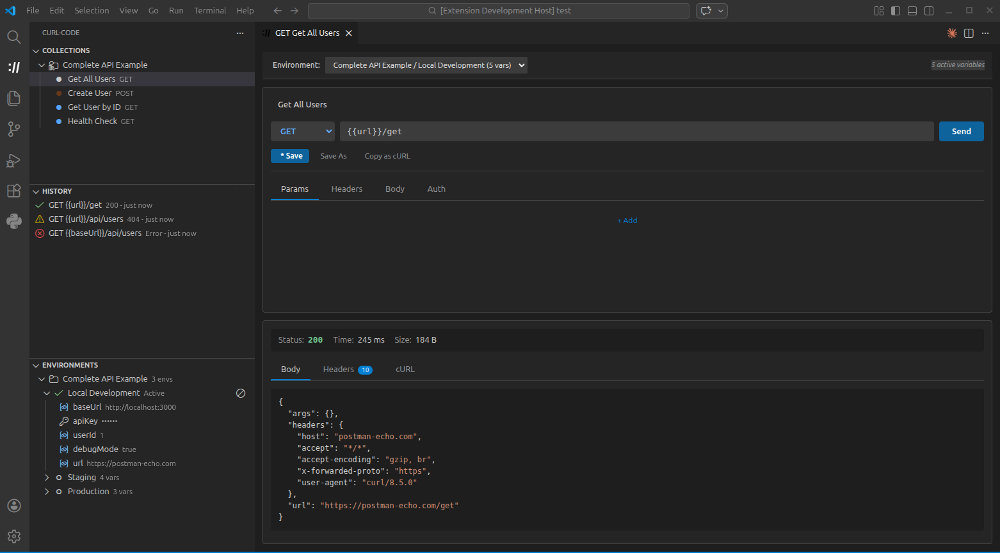

# curl-code

A full-featured HTTP client for VS Code with a clean UI and cURL backend.

> This extension is not affiliated with or endorsed by the cURL project or Daniel Stenberg.



## Features

- **Full REST Client**: Support for GET, POST, PUT, PATCH, DELETE, HEAD, and OPTIONS
- **Collections**: Organize requests into collections
- **Environments**: Global and collection-scoped variables with `{{variable}}` interpolation
- **Secret Management**: Sensitive values stored securely via VS Code's encrypted storage
- **History**: Track all your requests automatically
- **.http File Support**: Supports .http/.rest files with syntax highlighting
- **Authentication**: Basic Auth, Bearer Token, and API Key support
- **Response Viewer**: Syntax highlighting, headers, and timing info
- **Copy as cURL**: Export any request as a cURL command

## Settings

- `curl-code.curlPath`: Path to cURL executable (default: `curl`)
- `curl-code.timeout`: Request timeout in milliseconds (default: 30000)
- `curl-code.followRedirects`: Follow HTTP redirects (default: true)
- `curl-code.verifySSL`: Verify SSL certificates (default: true)
- `curl-code.saveRequestHistory`: Save request history (default: true)
- `curl-code.maxHistoryItems`: Maximum history items (default: 50)

## Requirements

- cURL must be installed on your system
- Most systems have cURL pre-installed
- Download from: https://curl.se/download.html

## Quick Start

1. Click the curl-code icon in the Activity Bar
2. Click "New Request" or press `Ctrl+Shift+N`
3. Enter a URL and click "Send" or press `Enter`

## Using .http Files

Create a file with `.http` or `.rest` extension:

```http
### Get Users
GET https://api.example.com/users
Authorization: Bearer {{token}}

### Create User
POST https://api.example.com/users
Content-Type: application/json

{
  "name": "John Doe",
  "email": "john@example.com"
}
```

Click the "Send Request" CodeLens above each request to execute it.

## Collections

Collections let you organize and save requests for reuse.

### Creating Collections

1. Open the curl-code sidebar
2. Click the folder **+** icon in the Collections section
3. Give your collection a name

### Saving Requests

- Click **Save** or **Save As** in the request panel

### Linked Collections

Collections can be linked to a `.json` file in your workspace. Changes to the file are reflected in the collection and vice versa. This is useful for sharing collections with your team via source control.

### Import / Export

- **Export**: Right-click a collection and select **Export Collection** to save it as a JSON file
- **Import**: Click the import icon in the Collections section to load a JSON collection file

> Exported collections never contain secret values — they are automatically redacted during export.

## Environments

Environments let you define variables that are substituted into your requests at send time. Use the `{{variableName}}` syntax anywhere in a URL, header value, request body, or authentication field.

### Global Environment

The global environment applies to all requests regardless of which collection they belong to. Manage it from the **Environments** section in the sidebar.

### Collection Environments

Each collection can have its own environments. This is useful for switching between configurations (e.g., `dev`, `staging`, `production`) without editing individual requests.

1. A new collection will be given an empty environment
2. Navigate to it in the **Environments** section
3. Create an environment and add variables

### Quick Switch

Click the environment name in the VS Code status bar to quickly switch the active environment.

## Secrets

Environment variables can be marked as **Secret** to protect sensitive values like API keys, tokens, and passwords.

### Creating a Secret Variable

1. Add a new variable to any environment (global or collection)
2. When prompted, select **Secret** as the variable type
3. Enter the value — input is masked as you type

### How Secrets Are Stored

- Secret values are stored in **VS Code's SecretStorage**, which uses your operating system's credential manager (Keychain on macOS, DPAPI on Windows, libsecret on Linux)
- Secrets are **never written to disk in plaintext** — collection JSON files contain only redacted placeholders
- Secrets are **automatically redacted** when exporting a collection
- In the sidebar, secret values are displayed as `••••••`

### Why This Matters

If you keep your collections in source control (e.g., linked collections in a `.json` file), your secret values will not leak into your repository. Only the variable names and non-secret values are persisted to disk.

## Authentication

The request editor supports built-in authentication methods:

- **None**: No authentication
- **Basic Auth**: Username and password (sent as Base64-encoded `Authorization` header)
- **Bearer Token**: Token value sent as `Authorization: Bearer <token>`
- **API Key**: Key-value pair sent as either a header or a query parameter

Authentication fields support `{{variable}}` interpolation, so you can store credentials in your environment.
